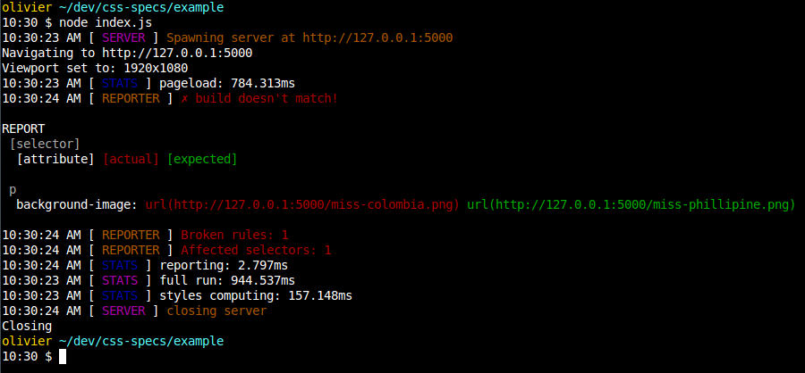

# css-specs (CSSS)
Report the differences from a builded css file after modification. Based on selector and rule specifications that are being saved automatically from any given local html file or external urls.

## Features
- Create a snapshot from existing compiled style
- Compare compiled styles to last valid snapshot for that css build
- Report differences displaying actual and expected css values
- JSON format output (can be converted to XML for jenkins report and such)
- can be pointed to any html template (remote or local)
- can load any stylesheet file that is local to your computer
- load remote stylesheets if present in the template or the remote server

## Pictures


## How to use
add in you project

`npm install --save css-specs`

create a config file named `css-specs.conf.js`

```javascript
module.exports = {
  prettySnapshots: false,
  snapshotPath: 'snapshots',
  port: 5000
};
```

When you require it, you have a few methods exposed to handle different use cases.

```javascript
var cs = require('..'); // that's our css-specs lib
var fs = require('fs');

var cssBuildPath = 'example.css'; // can be any local path
var url = './example.html'; // can be external urls as well

// get css as a string
var css = fs.readFileSync(cssBuildPath, 'utf-8');
```

`.renderer(url, css, callback)` is used to render the current page with the specified style and return computed values.

```javascript
cs.renderer(url, css, function(result) {
  /* do something with the results... */
});
```

`.snapshot.save(cssBuildPath, result.styles)` is used to save a result after being rendered.

```javascript
cs.renderer(url, css, function(result) {
  cs.snapshot.save(cssBuildPath, result.styles);
});
```

`.comparator.compare(cssBuildPath, result.styles)` is used to compare two different results.

```javascript
cs.renderer(url, cssToCheck, function(result) {
  var snapshot = require(cs.utils.snapshotPath(cssBuildPath));
  var diff = cs.comparator.compare(snapshot, result.styles);
});
```

Lastlyl, `.reporter(diffTree)` is used to output differences in the console in a nice way

```javascript
cs.renderer(url, cssToCheck, function(result) {
  var snapshot = require(cs.utils.snapshotPath(cssBuildPath));
  var diff = cs.comparator.compare(snapshot, result.styles);
  cs.reporter(diff); // <------
});
```

Refer to the [example](example/index.js) that you might run with `node index.js` for "real-life" usage.

## API
We encourage reading the source code from [the entry point](index.js) and the [config defaults](config.js)
